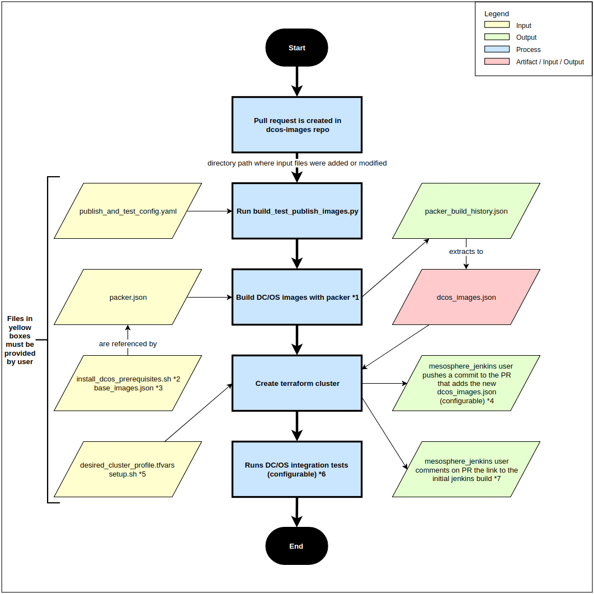

# dcos-images

The reference for DC/OS images and how to build them.  
The goal of this repo is to standardize, across all DC/OS users and developers, the usage and build process of OS cloud
images to run DC/OS.

## Find which DC/OS image to use
Look for the dcos_images.yaml file in the directory path that matches your requirements.  
Example: [centos/7.4/aws/DCOS-1.11.3/docker-1.13.1/dcos_images.yaml](https://github.com/dcos/dcos-images/blob/master/centos/7.4/aws/DCOS-1.11.3/docker-1.13.1/dcos_images.yaml).

## See a high-level view of what is supported
1. ```git clone https://github.com/dcos/dcos-images.git ~/dcos-images```
2. ```brew install tree``` or ```apt install tree```
3. ```cd ~/dcos-images```
4. ```tree```

There's also a [DC/OS Platform Version Compatibility Matrix](https://docs.mesosphere.com/version-policy/#dcos-platform-version-compatibility-matrix)

## Build and qualify new DC/OS images
Creating a pull request that either modifies or adds an install_dcos_prerequisites.sh or a packer.json file will trigger
a DC/OS image build. However, to have the entire pipeline succeed (image build + cluster creation + integration tests),
three more files are required (for a total of five). As seen in the yellow-colored boxes in the flowchart below, those
files are: **publish_and_test_config.yaml, packer.json, install_dcos_prerequisites.sh, base_images.json,
desired_cluster_profile.tfvars and setup.sh**.  
More details on those files [here](#required-files-to-build-and-qualify-new-dc/os-images).  
You must place those files inside the appropriate directory in line with the specs of the DC/OS images you are going to
build e.g. "centos/7.4/aws/DCOS-1.11.3/docker-1.13.1".

  
To modify the following chart, go to [draw.io](https://www.draw.io/) and import flowchart_draw_io.xml (located at the
root level of this repo)  
[See flowchart footnotes for help](#flowchart-footnotes)

### Required files to build and qualify new DC/OS images
- **base_images.json**  
Contains images published directly by the OS providers (CoreOS, CentOS, etc.). You can usually find them on the
provider's website. For example, you can find CoreOS AMIs [here](https://coreos.com/os/docs/latest/booting-on-ec2.html)

- **install_dcos_prerequisites.sh**  
Script that will run and be baked on top base images, which will form new images called a DC/OS images. 

- **packer.json**  
Packer configuration to build DC/OS images. Base images and install_dcos_prerequisites.sh are some of its inputs.

- **desired_cluster_profile.tfvars**  
Configuration for the terraform cluster that will be created using new DC/OS images. This cluster will be used to install
and test DC/OS with the new images.

- **publish_and_test_config.yaml**  
Determines what is required for newly-built images to be commited back to a pull request by jenkins. Also determines
what tests are ran on a pull request. [See this example](https://github.com/dcos/dcos-images/blob/master/oracle-linux/7.4/aws/DCOS-1.11.3/docker-1.13.1/publish_and_test_config.yaml#L1).
You can specify the field 'publish_dcos_images_after' with possible values: 'packer_build', 'dcos_installation',
'integration_tests' and 'never'. For example, if you want jenkins to push the newly-built DC/OS AMIs to my pull request as
soon as they are built by packer, you would specify 'packer_build'. If you want more confidence and want to make sure
a cluster can successfully spin up and install DC/OS by using this new image, you would specify 'dcos_installation'. That
is the default option. The 'never' is a bit different in the way that not only does it never commit the images back to
the pull request, but it also skips building them at all. This would be to only install DC/OS and run tests against the
current images. The 'tests_to_run' field allows you to run only specific integration tests. If you omit this field, they
will all run.

- **setup.sh**  
Unlike install_dcos_prerequisites.sh, this script won't be baked in DC/OS images. Instead it will only be ran by
terraform when the cluster comes up for a pull request. This can be useful for something that needs to be done on every
boot. In many cases, this file can be empty, **but it still needs to exist**.

### Flowchart footnotes
__*1__: In the case where we just want to test the image without rebuilding a new one, we can configure
publish_and_test_config.yaml to skip the packer build by specifying the field 'publish_dcos_images_after: never'
[as seen here](https://github.com/dcos/dcos-images/blob/master/oracle-linux/7.4/aws/DCOS-1.11.3/docker-1.13.1/publish_and_test_config.yaml#L2).
This can be especially useful when a new pull request is created, several images are built, but some flaky integration
tests fail. In that scenario, we might want to rerun the tests against those new images, in which case we would want to
avoid rebuilding identical images to test against.

__*2__: install_dcos_prerequisites.sh is directly referenced inside of packer.json

__*3__: base_images.json is NOT directly referenced in packer.json. The source_image field inside of packer.json matches
one of the images inside the base_image.json that existed at the time of the last packer build for that packer.json.
That base_images.json may or may not be the same as the current one.  
Before running a packer build, build_test_publish_images.py will replace whatever source_image the packer.json specifies
with the current us-west-2 image in base_images.json

__*4__: By default, if the terraform cluster launches successfully with the newly built images, those images will be
committed back to the repo. However, this is configurable. You can decide that the images should be committed to the
repo right after they are built, after they successfully pass the tests, or never committed at all. This can be
configured in publish_and_test_config.yaml with the field 'publish_dcos_images_after' [as seen here](https://github.com/dcos/dcos-images/blob/master/oracle-linux/7.4/aws/DCOS-1.11.3/docker-1.13.1/publish_and_test_config.yaml#L1).  
**IMPORTANT**: this new commit will trigger a new build for the pull request and make the status check go green
immediately (auto-success when mesosphere_jenkins commit is detected). This does not mean the cluster created
successfully or the tests successfully passed. It depends on publish_dcos_images_after field inside the
publish_and_test_config.yaml. You will need to follow the link to the initial build that gets posted on the pull request
as a comment. See *7.

__*5__: The contents of setup.sh will not be baked into the resulting DC/OS images. Instead, terraform will run that
script only when a cluster is created with those DC/OS images.

__*6__: More test suites will be added in the future, such as framework tests. Only minor modifications will need to be
made in build_test_publish_images.py. Which integration tests are ran can be configured in publish_and_test_config.yaml
by specifying the field 'tests_to_run' and a list of values [as seen here](https://github.com/dcos/dcos-images/blob/master/oracle-linux/7.4/aws/DCOS-1.11.3/docker-1.13.1/publish_and_test_config.yaml#L4).
If you want to run all the tests, simply remove that field.

__*7__: The link to the initial jenkins build will be posted as a comment on the pull request so that it can be found
easily after mesosphere_jenkins causes the pull request to trigger a new build by pushing a commit. Before merging a
pull request that creates new DC/OS images, you should always follow the initial link and check the status of the
terraform cluster creation and integration tests run. Typically, users would want mesosphere_jenkins to commit
dcos_images.yaml after the terraform cluster creates, then follow the link to the initial jenkins build, decide if
enough tests pass to qualify the new operating system, then either merge the pull request, retrigger the tests or update
the pull request with bug fixes. If they just want to retrigger the tests due to potential test flakiness, they should
push a new commit to do so, which would include a change to publish_and_test_config.yaml with the field
'publish_dcos_images_after: never' to avoid rebuilding identical new images.
